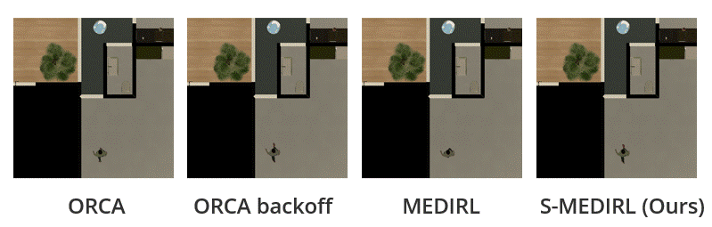

## Learning Implicit social Behavior 

This repository shares code for learning social behavior demonstrations in a photo-realistic simulator setup. We drive our robot in the Habiat-Sim Simulation environment with a human walking around to collect demonstration data and have it learn the implicit rules of socially aware behavior. 

The included dataset is for the door navigation scenario, where the agent learns to navigate a narrow crossing with a human walking from the other end. Our agent implicitly learns to reason about the scene geometry and the dynamic agents' observed trajectories and exhibits deadlock avoidance and yielding behavior, as seen in the demonstrated dataset. A gif of the agent working compared to other model-based baselines shows the qualitative results:




## Simulator setup: 
Code For Habitat-ROS interface with Humans walking around 

Installation:
1. Before you build the simulation docker file, make sure you have downloaded the submodules (Save them to local repositories that will get mounted to your docker image). Here is the git repo for each:

- habitat-lab: git clone -b dev https://github.com/UMich-CURLY/habitat-lab.git habitat-lab
- ORCA-Algorithm: git clone -b main https://github.com/UMich-CURLY/ORCA.git ORCA-Algorithm
- habitat-sim: git clone --branch v0.3.0 https://github.com/facebookresearch/habitat-sim.git habitat-sim
- habitat_ros_interface: git clone -b v0.3 https://github.com/UMich-CURLY/habitat_ros_interface.git habitat_ros_interface
- dataset: cd habitat-sim; python -m utils/datasets_download.py --uids hssd-hab hab3-episodes habitat_humanoids hab3_bench_assets

2. Next we need to build the Dockerfile:

```docker build -t sim .```

3. Launch the docker using the launch_docker.sh script. If you have all the submodules clones properly it will mount them all.
4. Next we need to build all the packages inside the docker container:

```
". activate habitat; cd habitat-sim; pip install -r requirements.txt; python setup.py install --bullet"
". activate habitat; cd habitat-lab; pip install -e habitat-lab/"
". activate habitat; cd habitat-lab; pip install -e habitat-baselines/"
". activate robostackenv; cd /home/catkin_ws; catkin_make"
```

5. To test if everything you want to run the following three in separate terminals:
```
   ". activate habitat; python examples/play_rvo_agent.py --cfg habitat-lab/habitat/config/benchmark/multi_agent/hssd_fetch_human_social_nav_irl.yaml --disable-inverse-kinematics"
   ". activate robostackenv; roslaunch habitat_interface simple.launch"
   ". activate robostackenv; roslaunch habitat_interface map_only.launch"

```

Visualize everything in RVIZ; This will have the agents running using ORCA crossing a door, but will not move yet, since it does not have the IRL agent running yet.

If you want to test out giving commands to the agent using the mouse in RVIZ, set USE_IRL_AGENT = False in the play_rvo_agent.py. 

We can also other different scenarios in the simulator. Example code to be shared soon! 

## Inverse Reinforcement Learning Setup 

Get the code from the git sub-module in medirl. Let's switch to the most recent branch:

```
git checkout -b maanis
```
Download the training dataset and weights to run from: https://drive.google.com/drive/folders/1KW0aw_sw_S307yYFsU_0Eh1KCd4hPOPR?usp=sharing

Let's build our Docker and run the code now:

1. Building the docker image, call it medirl:again:

  ```docker built -t medirl:again .```

2. Launch the docker using the launch_docker.sh script. If you have all the submodules clones properly it will mount them all.
3. Run the code to get the IRL agent path: ```python test_traj_rank_cloud.py```

You should see the agents communicate over ROS and this repository sending position goal based on the IRL inference to the simulator where the agent can then navigate to it. 

